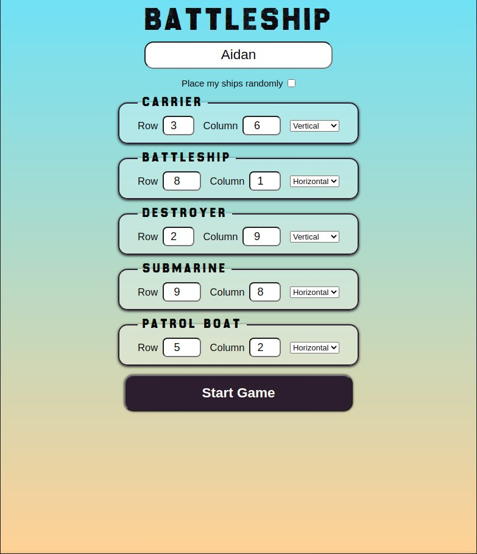
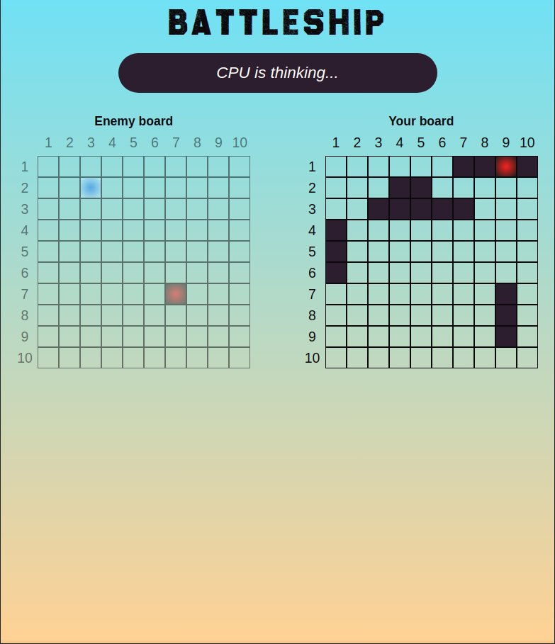

# Battleship

[See the project live](https://mckensis.github.io/battleship)

## About the project

- The Classic Battleship boardgame created in vanilla JS
- Created to practice TDD / Test-Driven Development
- I implemented a simple AI player to play against 

## How to Use

1. Enter player name
2. Choose ship placement or place randomly
2. Choose a cell to attack
3. Take turns with the AI player
4. First to sink 5 ships wins

## Screenshots

## Future Improvements

1. Add a ship placement grid to allow drag & drop of player ships to place them rather than choosing locations from drop down menus.

2. Improve the AI's algorithm.